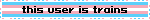

⟡ 𝚕𝚘𝚕𝚌𝚊𝚝 ╱ 𝚜𝚊𝚝𝚞𝚛𝚗 ⟡ ‧ ₊ ˚ ⊹  
\- - -  
⋄ aroace  
⋄ nyanbinary  
⋄ transfemme  
⋄ neurospicy  
⋄ out of memory  
\- - -   

 

<!-- https://blahaj.zone/@lolcatjpg>

<!--
**lolcatjpg/lolcatjpg** is a ✨ _special_ ✨ repository because its `README.md` (this file) appears on your GitHub profile.

Here are some ideas to get you started:

- 🔭 I’m currently working on ...
- 🌱 I’m currently learning ...
- 👯 I’m looking to collaborate on ...
- 🤔 I’m looking for help with ...
- 💬 Ask me about ...
- 📫 How to reach me: ...
- 😄 Pronouns: ...
- ⚡ Fun fact: ...
-->
